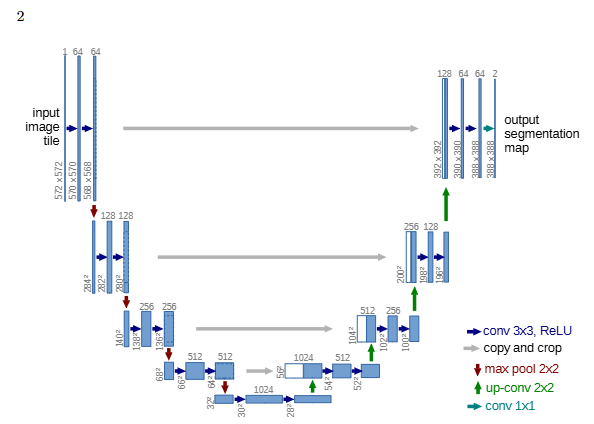
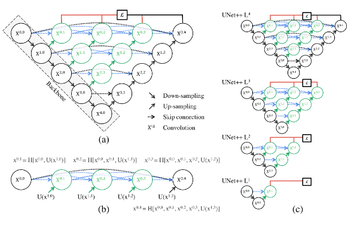

# U-Net vs. UNet++ for Nuclei Segmentation (DSB2018)


This repository contains a comprehensive Jupyter Notebook that implements, trains, and compares two deep learning architectures, **U-Net** and **UNet++** (Nested U-Net), for image segmentation. The project aims to identify and segment cell nuclei from microscopy images provided by the [Data Science Bowl 2018 (DSB2018) Kaggle competition](https://www.kaggle.com/competitions/data-science-bowl-2018/overview).

The entire workflow is contained in a single notebook, demonstrating:
* **EDA:** In-depth Exploratory Data Analysis of the image and mask dataset.
* **Preprocessing:** Loading, resizing, and merging individual masks into a single binary mask per image.
* **Model Implementation:** PyTorch implementations of both U-Net and UNet++ (with deep supervision) from scratch.
* **Training:** A complete training pipeline including a combined **BCE + Dice Loss**, Adam optimizer, and **Early Stopping**.
* **Evaluation:** A robust 70/10/20 Train/Validation/Test split for fair comparison using the **Intersection over Union (IoU)** metric.
* **Visualization:** Detailed plots of training history and visual comparison of segmentation results.

---

## 🏛️ Model Architectures

This project implements and compares two of the most influential architectures for semantic segmentation.

### 1. U-Net

The foundational encoder-decoder architecture. It introduces "skip connections" that merge deep, semantic feature maps from the encoder with shallow, high-resolution feature maps in the decoder, enabling precise localization.

<!-- *(Bạn hãy thêm ảnh sơ đồ U-Net chuẩn vào `assets/unet_architecture.png`)* -->



### 2. UNet++ (Nested U-Net)

An evolution of U-Net, it features "nested and dense skip connections" (as shown below) to bridge the semantic gap between the encoder and decoder. This project implements the **deep supervision** (L1-L4) variant, as described in the original paper, which helps the model produce accurate segmentation maps at multiple resolutions.

<!-- *(Ảnh kiến trúc UNet++ bạn đã cung cấp)* -->



---

## 🚀 Final Results

Both models were trained under identical conditions (learning rate, batch size, loss function, etc.) until validation IoU stopped improving (Early Stopping).

### Quantitative Results

The final performance was evaluated on the held-out 20% test set. UNet++ (with deep supervision) demonstrated a clear improvement in segmentation accuracy over the baseline U-Net.

| Model | Test Loss (BCE+Dice) | **Test IoU (Jaccard)** |
| :--- | :---: | :---: |
| **U-Net** | `0.1909` | `0.8476` |
| **UNet++ (Deep Supervision)**| `0.1348` | `0.8531` |

### Training History

The training curves below illustrate the convergence behavior of both models.

<!-- *(Bạn hãy chụp ảnh màn hình biểu đồ "Model Loss History" và "Model IoU History" và lưu vào `assets/results_plot.png`)* -->


### Qualitative Comparison

Visual inspection of the test set predictions shows that UNet++ often produces cleaner and more accurate boundaries for overlapping nuclei.

<!-- *(Bạn hãy chụp ảnh màn hình kết quả so sánh 4 cột (Image, Truth, UNet, UNet++) và lưu vào `assets/segmentation_demo.png`)* -->


---

## 📁 Project Structure

```
Nuclei-Segmentation-UNet-vs-UNetPlusPlus/
│
├── .gitignore          # Git ignore file
├── README.md           # This file
├── requirements.txt    # Python dependencies
│
├── notebooks/
│   └── unet_vs_unetpp.ipynb  # The main Jupyter Notebook with all code
│
└── assets/
    ├── unet_architecture.png   # (Ảnh bạn thêm vào)
    ├── architecture.png    # UNet++ architecture diagram
    ├── results_plot.png    # Screenshot of training history
    └── segmentation_demo.png # Screenshot of visual results
```

---

## 🛠️ How to Run

### 1. On Kaggle (Recommended)

The easiest way to run this project is to use the Kaggle environment.

1.  Create a new Kaggle Notebook.
2.  Upload the `notebooks/unet_vs_unetpp.ipynb` file.
3.  Click **"+ Add Data"** and search for and add the **"Data Science Bowl 2018"** dataset.
4.  Ensure the notebook's accelerator is set to **GPU**.
5.  Run all cells.

### 2. Local Setup

You can also run the project on your local machine if you have a CUDA-compatible GPU.

1.  **Clone the repository:**
    ```bash
    git clone [https://github.com/](https://github.com/)[YourUsername]/[YourRepoName].git
    cd [YourRepoName]
    ```

2.  **Create a virtual environment (optional but recommended):**
    ```bash
    python -m venv venv
    source venv/bin/activate  # On Windows: venv\Scripts\activate
    ```

3.  **Install dependencies:**
    ```bash
    pip install -r requirements.txt
    ```

4.  **Download the data:**
    * Download the [DSB2018 dataset from Kaggle](https://www.kaggle.com/competitions/data-science-bowl-2018/data).
    * Extract the `stage1_train/` folder.
    * **Important:** Open the notebook and modify the `TRAIN_DIR` variable (in the config cell) to point to the `stage1_train/` directory on your local machine.

5.  **Run Jupyter:**
    ```bash
    jupyter notebook notebooks/unet_vs_unetpp.ipynb
    ```

---

## 📦 Requirements

All required libraries are listed in `requirements.txt`. The primary libraries are:

* `torch`
* `numpy`
* `matplotlib`
* `scikit-image`
* `tqdm`
* `jupyter`